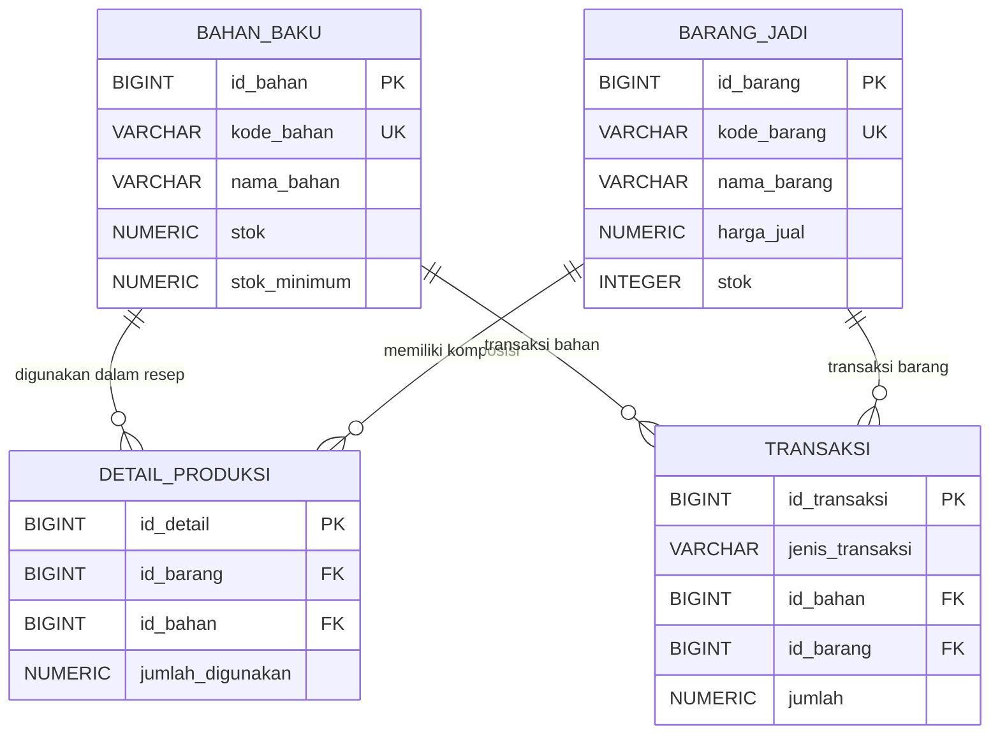

# Sistem Persediaan Toko Butik

[Buka Aplikasi](./Frontend/html/index.html)

## Schema Visualizer

Berikut visualisasi relasi utama antar tabel. Diagram Mermaid akan dirender pada viewer Markdown yang mendukung Mermaid.



### Penjelasan ERD

- `BAHAN_BAKU` dan `BARANG_JADI` adalah tabel master bahan serta produk butik.
- `DETAIL_PRODUKSI` menghubungkan barang jadi dengan bahan baku sebagai resep. Satu barang dapat memakai banyak bahan dan satu bahan dapat digunakan oleh banyak barang. `jumlah_digunakan` adalah kebutuhan bahan untuk satu unit produk.
- `TRANSAKSI` mencatat perubahan stok. `MASUK` dan `BAHAN_KELUAR` merujuk ke bahan baku; `PRODUKSI` dan `KELUAR` merujuk ke barang jadi. Setiap transaksi hanya memiliki satu target sesuai jenisnya.
- Notasi `||` berarti tepat satu, sedangkan `o{` berarti nol atau banyak. Dengan demikian, satu barang atau bahan dapat belum memiliki atau memiliki banyak resep/transaksi, sementara setiap baris resep merujuk tepat ke satu barang dan satu bahan.

Penjelasan lengkap setiap tabel, kolom, constraint, perilaku trigger, dan kebijakan akses tersedia di [dokumentasi skema database](docs/skema-database.md).

Aplikasi web sederhana untuk mengelola persediaan bahan baku dan barang jadi butik. Frontend menggunakan HTML, CSS, dan JavaScript, sedangkan penyimpanan data serta pemrosesan transaksi menggunakan PostgreSQL melalui Supabase.

## Fitur

- Dashboard ringkasan persediaan dan transaksi.
- Pengelolaan data bahan baku dan barang jadi.
- Pencatatan transaksi bahan masuk, pemakaian bahan, produksi, dan barang keluar.
- Pengelolaan resep produksi barang jadi.
- Tampilan persediaan berdasarkan data yang tersimpan di Supabase.
- Validasi stok dan pembaruan saldo melalui trigger database.

## Teknologi

- HTML, CSS, dan JavaScript tanpa proses bundling.
- Supabase Database (PostgreSQL) dan Supabase JavaScript Client v2 melalui CDN.
- Row Level Security (RLS) pada tabel data.

## Struktur Folder

```text
Sistem Persediaan Butik/
├── Backend/
│   ├── database.sql
│   └── supabase/
│       └── config.js
├── Database/
│   └── database.sql
├── docs/
│   └── skema-database.md
└── Frontend/
    ├── css/
    │   └── style.css
    ├── html/
    │   └── index.html
    └── js/
        └── SCRIPT.JS
```

## Persiapan Database

1. Buat proyek di [Supabase](https://supabase.com/) atau gunakan proyek Supabase yang sudah tersedia.
2. Buka **SQL Editor** pada dashboard Supabase.
3. Jalankan isi `Backend/database.sql` untuk membuat tabel, constraint, indeks, trigger, kebijakan RLS, dan data contoh.
4. Pastikan tabel `bahan_baku`, `barang_jadi`, `detail_produksi`, dan `transaksi` berhasil dibuat.

`Database/database.sql` merupakan salinan skema yang sama. Gunakan salah satu berkas SQL tersebut, bukan keduanya secara berurutan.

## Konfigurasi Supabase

Frontend menggunakan konfigurasi dari `Backend/supabase/config.js`. Sesuaikan URL proyek dan publishable/anon key dengan nilai pada pengaturan API proyek Supabase:

```js
const SUPABASE_URL = "https://<project-ref>.supabase.co";
const SUPABASE_ANON_KEY = "<publishable-or-anon-key>";
```

Keduanya digunakan di browser, jadi jangan menaruh `service_role` key atau secret key di file frontend. Akses anon harus diamankan dengan kebijakan RLS yang sesuai. Kebijakan pada SQL saat ini bersifat terbuka untuk kebutuhan demo/tugas dan perlu dibatasi sebelum digunakan di lingkungan produksi.

## Menjalankan Frontend

Karena frontend berupa berkas statis, tidak diperlukan proses build atau instalasi package.

1. Buka folder proyek di VS Code.
2. Jalankan `Frontend/html/index.html` dengan ekstensi **Live Server** atau server statis lokal lainnya.
3. Pastikan koneksi internet tersedia agar Supabase JavaScript Client v2 dapat dimuat dari jsDelivr CDN.
4. Pastikan database sudah disiapkan dan konfigurasi Supabase sudah sesuai.

Frontend memuat skrip dengan urutan: Supabase JS v2 dari CDN, `Backend/supabase/config.js`, kemudian `Frontend/js/SCRIPT.JS`.

## Alur Persediaan

- `MASUK` menambah saldo bahan baku.
- `BAHAN_KELUAR` mengurangi saldo bahan baku untuk pemakaian langsung.
- `PRODUKSI` mengurangi bahan sesuai resep dan menambah saldo barang jadi.
- `KELUAR` mengurangi saldo barang jadi, misalnya untuk barang terjual.

Produksi ditolak apabila resep belum dibuat, ada bahan resep yang nonaktif, atau stok bahan tidak mencukupi. Jumlah produksi dan barang jadi keluar harus berupa bilangan bulat.

## Dokumentasi Skema

Penjelasan tabel, kolom, relasi ERD, aturan trigger, dan catatan keamanan database tersedia di [docs/skema-database.md](docs/skema-database.md).

## Catatan

- Trigger pemrosesan stok berjalan saat transaksi baru dimasukkan. Mengubah atau menghapus transaksi secara langsung tidak otomatis membalikkan atau menghitung ulang stok.
- Sistem ini mencatat pergerakan stok, tetapi belum menyediakan modul lengkap pelanggan, pemasok, nota penjualan, dan pembayaran.
- Gunakan `aktif` untuk menonaktifkan bahan atau barang dari pemakaian tanpa menghapus riwayat terkait.
